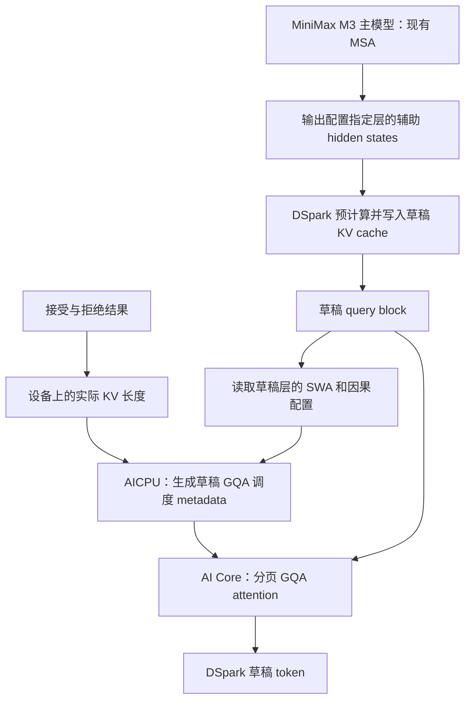

# MiniMax M3 + DSpark 接入 A3 FlashAttention NPU 的适配说明

## 1. 汇报结论

本次适配针对 MiniMax M3 主模型 MSA 与 DSpark 草稿模型 GQA 共存的
ModelRunner V2 推理链路。增加可独立选择的草稿 attention backend，接入
`flash-attn-npu==0.4.2.post1` 的分页 GQA 和设备端 AICPU 调度 metadata，
支持标准 SWA 1024、因果 attention 和非因果 attention。

同时修复 MiniMax M3 辅助 hidden states 仅在 EAGLE3 模式启用的问题，
使 MRV2 能将 DSpark 所需的主模型中间特征传给草稿模型；补齐 M3
导入兼容层的符号，并隔离草稿后端选择缓存和主模型图能力判断。

交付定位为 **Draft 适配代码及验证用例**。CPU 回归验证可以证明后端选择、
参数映射、设备长度来源、缓存布局与辅助特征控制逻辑；目前没有完成 A3
算子数值测试、真实 MiniMax M3 + DSpark 推理和性能对比，不能据此宣布
生产 ready，也不能承诺无性能损失。

## 2. 代码与算子基线

| 项目 | 基线 |
| --- | --- |
| vLLM Ascend | 上游 main，`05fa3be5f50306a151d4863735d3d84ce63dc0a2` |
| 本地分支 | `feat/dspark-fa3-mrv2` |
| 目标硬件 | Ascend A3 / 910C |
| 推理框架 | ModelRunner V2 |
| 算子分发包 | `flash-attn-npu==0.4.2.post1` |
| 算子 Python 模块 | `flash_attn_npu_3` |
| 算子 tag | `v0.4.2.post1`，`e813f5f162260498241e4b24bfb7d1c4e8ffaf8a` |
| 核心入口 | `get_scheduler_metadata`、`flash_attn_with_kvcache` |

这里的“最新代码”指开始实施时实际获取的上游 main 快照。
发布包、tag 和仓库 main 不能混用：后续 main 的参数签名可能变化，
本次按照上述固定版本接入。

### 2.1 已核实的公开主模型与草稿模型

本次通过公开模型 API、固定 revision 的 `config.json` 和 NVIDIA
Model Optimizer 源码核对了以下组合，不再使用未确认的草稿模型名称：

| 项目 | 主模型 | 草稿模型 |
| --- | --- | --- |
| Hugging Face model ID | `MiniMaxAI/MiniMax-M3` | `nvidia/MiniMax-M3-DSpark` |
| 查验 revision | `f0e1c1e04d40177e4673a22097036854f536e9c0` | `e82db0e1895bc4e0c339ce670b2b553899a57f59` |
| 模型架构 | `MiniMaxM3SparseForConditionalGeneration` | `Qwen3DSparkModel` |
| 文本 hidden size | 6144 | 6144 |
| 词表大小 | 200064 | 200064 |
| 文本层数 | 60 | 6 |
| Query / KV heads | 64 / 4 | 32 / 8，即 GQA 比例 4 |
| Head dimension | 128 | 128 |
| Attention | 主模型配置中的 MSA | 六层均为 SWA 1024、`causal=false` |

草稿的 `dflash_config.target_layer_ids` 是 `[1, 12, 23, 35, 46, 57]`，
`mask_token_id=200063`，`shift_label=true`。草稿使用 Markov head，
`markov_rank=256`，并携带 confidence head 配置。

两个“block size”必须区分：草稿 `block_size=8` 表示一次预测的块宽，
主模型 MSA 的 `sparse_block_size=128` 表示 KV 分页粒度。
这个 DSpark 模型以 anchor 位置作为第一次预测，八个 query 产生八个
草稿 token，示例使用 `num_speculative_tokens=8`，与官方模型卡一致。
不能沿用普通 DFlash 的“一个 bonus anchor 加 N 个 mask”约定而减一。

草稿原始配置的 `torch_dtype=float32` 不能直接作为外部算子的输入类型。
当前 vLLM 创建草稿 `ModelConfig` 时沿用主模型 dtype；主模型应明确使用
`--dtype bfloat16`，并保持草稿 `kv_cache_dtype=auto`。

这里完成的是模型配置与接口语义核对。已检查的本地权重目录和启动配置
尚未定位到这对 M3 / DSpark checkpoint；没有因此下载模型权重、启动服务
或声称整模型验证通过。

## 3. 业务问题与改动目的

### 3.1 主模型和草稿模型使用不同的 attention

MiniMax M3 主模型的 MSA 含有稀疏选择与对应缓存语义，不能用普通 GQA
算子直接替换。DSpark 草稿 GQA 需要独立的窗口、因果属性和缓存参数。

如果把外部 FA3 设置为全局默认，可能把主模型普通 attention 或原有训练
一致性路径一起切换，扩大影响面。因此本次使用已有的
`speculative_config.attention_backend`，仅在构建 DSpark 草稿模型的
`dspark_head` 上下文中启用新后端。

### 3.2 旧 FA3 后端不能直接满足本次需求

现有 `fa3_v1.py` 使用旧模块名 `flash_attn_npu_v3`，拒绝滑窗配置，
并将 decode 和 prefill 的因果参数固定为不同值；它还没有传入设备端
`scheduler_metadata`。它的使用目标是训练推理一致性。

本次新建后端，避免改变已有 RL 使用者的参数、依赖与运行方式。

### 3.3 DSpark 的有效 KV 长度不能用 CPU 上界代替

接受或拒绝草稿 token 后，设备上的有效 KV 长度可能缩短。CPU 保存的
乐观长度上界可能包括被拒绝的 token 或尚未写入的 lookahead 位置。
非因果 attention 如果读到这些位置，结果会发生变化。

新 metadata builder 直接使用 `CommonAttentionMetadata.seq_lens`
的设备张量视图，不通过 `.cpu()`、`.item()` 或 KV 长度 `.tolist()`
将其回传主机，也不将 CPU 上界当作算子实际有效长度。

### 3.4 去掉草稿 GQA 动态 tiling 对主机长度的依赖

Host tiling 路径需要把 KV 长度传回 CPU，再由 CPU 生成分块、任务数量、
核间拆分和临时空间等参数。长度数据很少，但同步会让主机等待设备结果。

新路径调用 `get_scheduler_metadata`，由 AICPU 读取设备有效长度并生成
调度计划，再将原始返回张量交给 attention。主机仍执行参数检查和算子
提交；这里并不声称消除框架内所有 CPU 工作或所有设备主机同步。

## 4. 适配后的数据链路



MSA 计算与稀疏选择接口保持现有实现。本次对主模型增加的是 DSpark
辅助特征输出条件，**没有实现主模型 MSA 的 tiling 下沉**。
主模型 MSA 的下沉需要其自身算子 metadata 接口，应作为独立工作推进。

## 5. 具体改动及原因

| 文件 | 改动 | 目的 |
| --- | --- | --- |
| `vllm_ascend/attention/dspark_fa3.py` | 新增草稿 GQA 后端、设备长度 metadata builder 和算子适配 | 支持标准 SWA / 非因果，并调用 AICPU metadata |
| `vllm_ascend/platform.py` | 新增 DSpark 草稿专用选择和能力检查 | 只在显式配置时启用，排除不支持的输入 |
| `vllm_ascend/device/hardware_profile.py` | 为 A3 声明外部 metadata 接口能力 | 不将 A3 适配默认扩展到其他硬件 |
| `vllm_ascend/models/minimax_m3/minimax_m3.py` | 辅助特征启用条件加入 DSpark | 补齐 MSA 主模型到 GQA 草稿的输入链路 |
| `vllm_ascend/models/minimax_m3/minimax_m3_vl.py` | 补齐 CUDA fusion fallback 的公共导入符号 | 避免 DSpark 公共 proposer 导入 Kimi helper 时缺少符号 |
| `vllm_ascend/worker/v2/attn_utils.py` | 支持声明需要连续 K/V 的后端视图 | 让外部算子的缓存地址计算与 MRV2 存储一致 |
| `vllm_ascend/worker/v2/spec_decode/dspark/speculator.py` | 显式 FA3 草稿加载前后清理 selector 缓存 | 防止相同 attention 参数跨主模型 / 草稿复用错误后端 |
| `vllm_ascend/patch/worker/patch_v2/patch_model_runner.py` | 对新 eager 草稿按主模型层重新统计图能力 | 避免草稿 NEVER 标记关闭主模型 MSA 的图执行 |
| `tests/ut/attention/test_dspark_fa3.py` | 参数、选择、设备长度、跨层复用和缓存布局回归 | 覆盖与本次接入直接相关的失败条件 |
| `tests/ut/models/minimax_m3/test_minimax_m3_dspark.py` | 辅助特征输出回归 | 保证 DSpark / EAGLE3 启用，其余模式不采集 |
| `tests/ut/worker/test_model_runner_v2_kv_cache.py` | 主模型图能力隔离回归 | 证明新 eager 草稿不会连带关闭主模型图执行 |
| `tests/e2e/nightly/single_node/ops/singlecard_ops/test_dspark_fa3_attention.py` | 实际算子与 SDPA 对照 | 为 A3 数值验证提供可执行用例 |

### 5.1 GQA 识别与 MRV2 兼容

新后端继承 `AscendAttentionBackend`。现有 DSpark speculator 通过
该继承关系识别 GQA，因此沿用现有 metadata 包装、cache group 和
输入准备链路，无需另写一套 ModelRunner。

builder 使用每个 cache group 的 `causal`，实现使用每层的
`sliding_window`。不同层或 group 可以分别使用 full / SWA 和因果 / 非因果。

### 5.2 窗口和 mask 的精确定义

| 模式 | `causal` | `window_size` |
| --- | --- | --- |
| 全量因果 | `True` | `(-1, -1)` |
| 全量非因果 | `False` | `(-1, -1)` |
| SWA 1024 因果 | `True` | `(1023, 0)` |
| SWA 1024 非因果 | `False` | `(1023, 1023)` |

减一的原因是窗口参数表示距离，vLLM 的窗口定义包含 query 自身。
非因果窗口对称化沿用 vLLM GPU FlashAttention 的约定，双向可见 token
总数不一定等于 1024。

算子使用右下对齐：某请求有效 KV 长度为 `Lkv`、query 长度为 `Lq`，
第 `i` 个 query 的逻辑位置为 `Lkv - Lq + i`。mask 在这个位置上施加窗口
和因果限制，不能将每个请求的 query 都从 KV 第零个位置开始对齐。

对已核实的 `nvidia/MiniMax-M3-DSpark`，NVIDIA Model Optimizer 的
`_build_generate_swa_mask` 在推理时使用以下可见性：

1. 历史 context 满足 `k < Lctx` 且 `k > absolute_q - 1024`；
2. 当前八个位置的 anchor block 全部可见；
3. 每个请求只有当前一个草稿块，其他请求通过分页表与 query 边界隔离。

这里 `Lkv = Lctx + 8`，所以 `absolute_q = Lctx + i`。窗口左界
`absolute_q - 1023` 与源码的严格不等式 `k > absolute_q - 1024`
相同；块内最大距离只有 7，小于 1023，因此对称窗口完整保留整个块。
所以 **对这个 checkpoint 的单 Anchor 块推理，标准非因果 SWA 可以
准确表达 mask**，不需要额外的 dense mask 或每步构造 `[Q, K]` 张量。

新增 CPU 回归在 context 长度 0、1、1015、2045 时，分别使用实际后端
传出的窗口和训练代码的 context / block 定义构造布尔可见性并逐元素比较，
覆盖短 context、1024 边界和长 context。它同时验证上游模型配置解析器
对六层都解析为 `(1024, False)`。

训练阶段多个 anchor 共用一段长 context 时，还需要同块可见性与不同
anchor 间隔离，不能直接用一整个标准滑窗替代。当前公开 v3 接口没有
通用 Anchor mask 参数；本次只接当前推理的单块路径，不扩展到多 Anchor
训练、窗口小于块宽或其他特殊 mask。

### 5.3 metadata 与算子参数保持一致

`0.4.2.post1` 会把 scale、softcap 等参数写入 metadata 并验证创建参数。
以下内容必须在 metadata 创建与 forward 中保持一致：

- `causal`、`window_size`；
- `softmax_scale`、`softcap`；
- `max_seqlen_q`、`num_splits`；
- 分页大小，以及 `page_size × page_table.shape[1]` 给出的 KV 容量。

`max_seqlen_q` 是 query 的最大长度，不是最大 KV 长度。分页 KV 的
`max_seqlen_k` 使用静态容量，实际有效长度仍由设备张量提供。
metadata 返回张量直接传入 forward，不通过 clone 丢失参数指纹。

### 5.4 缓存布局适配不会每步复制整份 KV

最新 MRV2 的普通 GQA 可能使用按块交错的 K/V 存储，或带额外 page
padding 的视图。外部算子按连续 NHD 缓存地址计算，不能直接读这种块步长。

新后端声明 `requires_contiguous_kv_cache`。MRV2 初始化时在已有 raw
buffer 上建立连续 K 与 V 视图，padding 放在有效区域之外；分离的 K/V
buffer 也按逻辑缓存大小截取有效区域。这个操作不增加每步整份缓存复制，
也不在热路径做 `permute().contiguous()`。

已有 cache-update hook 负责写入 K/V。attention 调用不再传 append-KV
参数，避免重复写入，也避开该版本 append-KV 与滑窗组合的限制。

### 5.5 metadata 复用范围

同一 forward 中，调度参数完全相同的层复用一次 AICPU metadata，减少
重复 launch。key 包含 head 数、head 维度、dtype、分页容量、窗口、因果、
scale 和 softcap；不同参数不能共用。

每次 builder 创建新的 step metadata，下一轮不复用上一轮计划，以免
拒绝采样后长度变化仍使用旧调度。该复用不依赖全局可变缓存。

### 5.6 M3 与 DSpark 的公共模块导入兼容

M3 现有适配通过 fallback 模块避免直接导入 CUDA-only 的融合归一化
代码。DSpark 的公共 proposer 还会导入 Kimi 的 RMSNorm helper，后者
需要同一模块的三个 fusion 能力符号；旧 fallback 只提供 Gemma 函数。

补齐这三个符号，并明确将 CUDA fusion 标记为不可用，使 helper 使用
普通 all-reduce 与 RMSNorm 路径。该调整解决模块导入问题，不用 CUDA
实现替换 M3 的 Ascend MSA 或归一化计算。

### 5.7 主模型与草稿的选择缓存和图执行隔离

上游 attention selector 的缓存 key 不含 `model_tag`。如果主模型的 GQA
与因果草稿具有相同的 attention 参数及 `FLASH_ATTN` 配置，可能把主模型
后端复用给草稿，或者反过来复用。显式选择新后端时，只在草稿加载前后
清理该缓存；这个操作发生在模型初始化，不进入每步推理热路径。

MRV2 原有初始化会统计全部 attention group 的图能力，新后端的 `NEVER`
会拉低整体结果。对本次显式开启的 eager FA3 草稿，初始化改为按主模型
层集合重新统计主模型图能力；草稿由其独立 graph manager 按 eager 配置
运行。新后端同时要求 `speculative_config.enforce_eager=true`，防止遗漏
配置而进入未经验证的草稿图路径。

这样可以避免新后端连带关闭主模型 MSA 的图执行，但不等价于已经证明
端到端性能不退化。

## 6. 启用方式

安装和配置步骤见
[使用说明](../../user_guide/feature_guide/dspark_flash_attention.md)。
关键配置是：

```json
{
  "method": "dspark",
  "model": "nvidia/MiniMax-M3-DSpark",
  "revision": "e82db0e1895bc4e0c339ce670b2b553899a57f59",
  "num_speculative_tokens": 8,
  "attention_backend": "FLASH_ATTN",
  "kv_cache_dtype": "auto",
  "enforce_eager": true
}
```

草稿的窗口、因果属性和辅助层编号应以训练 checkpoint 为准，
不能仅根据这份示例覆盖其他模型配置。主模型使用上述公开 model ID
或其本地权重目录，保留原有 A3 MSA 部署参数、`--block-size 128`，
并明确设置 `--dtype bfloat16`。model ID 和配置已查明，实机环境与整模型
数值和性能验证仍未完成。

## 7. 验证证据与验收范围

### 7.1 CPU 单元验证

单元验证针对接入协议和缓存布局，外部 NPU 算子使用 mock。
它不代表实际 NPU 数值正确或整模型推理通过。

覆盖项目包括：

- 显式草稿选择与主模型隔离；
- 主模型 / 草稿 attention selector 缓存隔离及主模型图能力保留；
- A3 / MRV2 要求与不支持功能的失败提示；
- 全量 / SWA 1024 与因果 / 非因果参数组合；
- 公开 M3 DSpark 六层配置解析及单 Anchor 块 mask 等价性；
- CPU 上界含有拒绝 token 时仍使用设备有效长度；
- 自定义 scale 与 metadata 指纹一致；
- 只处理真实 query token，保留输出 padding；
- 连续缓存与 page padding，K/V 不重叠且共享原始存储；
- 相同层参数复用、不同参数隔离、下一步重新生成；
- M3 采集带 residual 的辅助特征，后续 residual 修改不影响采集结果。
- M3 fallback 提供 DSpark 公共模块需要的导入符号。

实际运行结果为 **274 passed，14 个现有 TorchScript 弃用提示**。
运行范围包括新后端与 M3 辅助特征用例，以及现有 M3、硬件能力、MRV2
attention / cache、DSpark speculator 和 graph contract 回归，共 8 个文件。

当前源码 checkout 未生成原生 `_build_info`，本地 CPU 验证在 pytest
启动前注入 A2 build 标识并禁用 Torch NPU 自动加载，再使用仓库现有 CPU
mock fixture。该启动辅助脚本不包含在 PR 中，也不替换 attention 算子的
数值实现。完整日志保存在本地 `dspark-fa3-mrv2-validation.log`。

CPU 验证环境记录：Python 3.11、Torch 2.10.0、torch-npu 2.10.0.post7、
vLLM 0.30.0+empty、pytest 8.3.2。这是本次单元测试环境，不能当作
指定算子包、CANN 和 A3 的共同部署兼容性验收结果。

### 7.2 代码质量检查

仓库要求的 `bash format.sh ci` 已尝试执行。首次遇到 npm 的系统 CA
配置问题，随后遇到 ARM 主机缺少匹配的检查工具：默认下载的 gitleaks
为 x86 二进制，shellcheck 未安装，actionlint 的 Go 环境安装阻塞。

使用系统 CA，并在 `/tmp` 安装官方 ARM 工具后，其余仓库 hook 全部
通过，包括 Ruff、Markdown、拼写、secret scan、shellcheck、PNG 和
Python 源码规则。actionlint 采用仓库固定的 1.7.7 版本单独执行，
按原 hook 规则排除 `scripts/` 与 `configs/`，检查 49 个 workflow 文件，
结果通过。原始 Go 环境安装仍未完成，因此不把未经调整的完整脚本执行
描述为成功。

这些工具调整只涉及本地检查环境，没有修改仓库的 CI 配置。

### 7.3 已提供但尚未执行的 A3 数值验证

新增 NPU 用例采用随机分页地址、两种 query 长度、自定义 scale，
与 float32 dense SDPA 对照，覆盖两种 dtype 和四种 mask 组合。
它还在同一设备长度 buffer 上模拟长度缩短，并将有效长度以外的缓存
改成大值，验证这些 token 不影响输出。

仍需在安装了指定算子包的 A3 环境执行该用例。

### 7.4 整模型与性能验收

| 验收项 | 需要证明的内容 | 当前状态 |
| --- | --- | --- |
| 算子数值 | SWA 边界、非因果、分页 GQA、拒绝 token 隔离 | 用例已提供，未实机执行 |
| M3 + DSpark | 主模型辅助层、草稿权重及缓存配置正确 | 未运行真实 checkpoint |
| 动态 tiling | trace 中调用 AICPU metadata，无草稿有效长度 D2H | 代码路径已接入，待实机 trace |
| FULL graph | 重放时变化的设备长度确实改变调度 | 本次未启用 |
| 性能 | 接受率、吞吐、TPOT 和 metadata 时间对比 | 未测量 |
| 主模型 MSA 下沉 | 主模型自身 metadata 接口与稀疏计算闭环 | 本次范围之外 |

## 8. 性能收益与约束

预期收益来自减少草稿 GQA 的有效长度回传和 Host 动态 tiling 等待，
以及多个相同参数草稿层复用设备 metadata。初始化缓存视图的改动不增加
每步整份 KV 搬运。

该版本公共 Python 入口返回独立的 attention 输出，本后端只将真实
query 范围写回 vLLM 输出 buffer；仍有结果写回成本，应纳入性能测量。

但 AICPU metadata、事件依赖、外部算子本身和 eager 调度均存在成本。
本次 builder 明确声明不支持 FULL graph，草稿使用 eager，因此相对已启用
图执行的旧草稿路径可能退化。主模型 MSA 内其他同步也可能仍是瓶颈。

上线验收应使用同一 checkpoint、同一 batch / TP / 长度分布比较：

1. 原 FIA 草稿路径；
2. 新外部 GQA 后端的 eager 路径；
3. 将来实机验证通过后，新后端的 graph 路径。

记录接受率和生成结果、吞吐、TPOT、主模型时间、草稿时间、AICPU
metadata 时间和 D2H 事件。不能将“删除了一段 CPU 长度读取”直接转化为
“端到端没有性能损失”的结论。

## 9. Draft PR 的定位与下一步

本次 PR 用于审阅接口接入、长度与 mask 语义、MRV2 缓存布局和验证方案。
已核实公开草稿 checkpoint 的单 Anchor 块 mask 定义，下一步优先补齐 A3 算子数值与
MiniMax M3 + DSpark 的整模型验证，再评估 FULL graph 和性能。

fork 的 main 与本次上游基线存在历史分歧，因此准备从上述最新 main
建立独立 review 基线分支，避免 PR 引入无关的历史改动。

## 10. 一手依据

- [主模型固定配置](https://huggingface.co/MiniMaxAI/MiniMax-M3/blob/f0e1c1e04d40177e4673a22097036854f536e9c0/config.json)：MSA、KV block size 128、主模型文本维度。
- [草稿固定配置](https://huggingface.co/nvidia/MiniMax-M3-DSpark/blob/e82db0e1895bc4e0c339ce670b2b553899a57f59/config.json)：GQA、六层 SWA 1024、非因果、辅助层和 block size 8。
- [草稿固定模型卡](https://huggingface.co/nvidia/MiniMax-M3-DSpark/blob/e82db0e1895bc4e0c339ce670b2b553899a57f59/README.md)：主模型配对与 `num_speculative_tokens=8` 示例。
- [NVIDIA Model Optimizer 单块生成 mask](https://github.com/NVIDIA/Model-Optimizer/blob/54d44161e50e2253b241f2130ba856a3bac881c4/modelopt/torch/speculative/plugins/hf_dflash.py#L664)：逐 query 的 context 滑窗与块内可见性。
- [NVIDIA M3 DSpark 训练配置](https://github.com/NVIDIA/Model-Optimizer/blob/54d44161e50e2253b241f2130ba856a3bac881c4/tools/launcher/examples/MiniMaxAI/MiniMax-M3/hf_streaming_dspark_multi_node.yaml)：草稿维度、block 8、MSA page 128 和辅助特征编号。
- [固定版本的 Python 接口](https://github.com/MinghuasLab/flash-attention-npu/blob/e813f5f162260498241e4b24bfb7d1c4e8ffaf8a/flash_attn_npu_3/flash_attn_npu_interface.py)：窗口、分页参数与 metadata 指纹。
- [固定版本的 Host / metadata 分支](https://github.com/MinghuasLab/flash-attention-npu/blob/e813f5f162260498241e4b24bfb7d1c4e8ffaf8a/csrc/ascend910/flash_attn_npu_3/flash_api.cpp)：Host 长度回传、AICPU launch 与静态容量。
- [固定版本的 AICPU metadata](https://github.com/MinghuasLab/flash-attention-npu/blob/e813f5f162260498241e4b24bfb7d1c4e8ffaf8a/csrc/ascend910/flash_attn_npu_3/fa_metadata.aicpu)：动态有效长度、任务拆分和窗口处理。
- [PyPI 发布包](https://pypi.org/project/flash-attn-npu/0.4.2.post1/)：本次固定的包版本。
